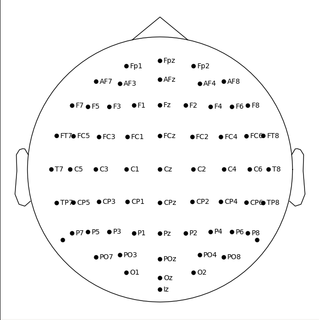
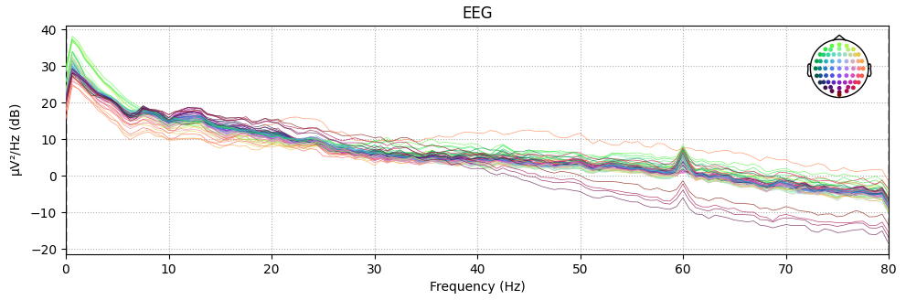
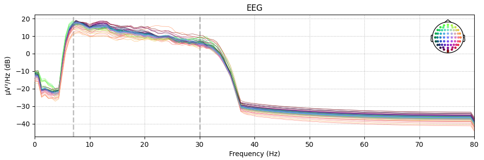
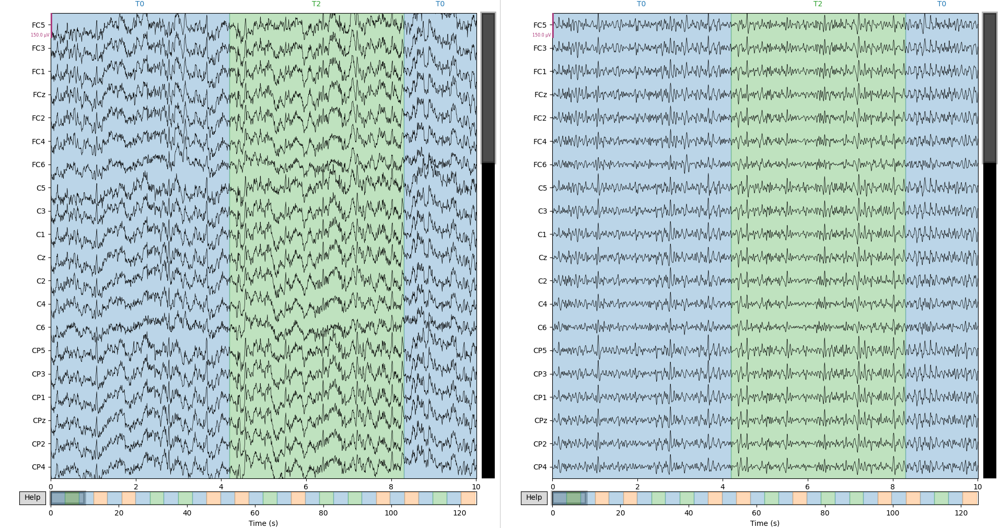

<div>
  
</div>

# Total_Perspective_Vortex

## Introduction
This subject aims to create a brain computer interface based on electroencephalographic
data (EEG data) with the help of machine learning algorithms. Using a subject’s EEG
reading, you’ll have to infer what he or she is thinking about or doing - (motion) A or B
in a t0 to tn timeframe.

42 subject: https://cdn.intra.42.fr/pdf/pdf/84885/en.subject.pdf

The subject focuses on implementing the algorithm of dimensionality reduction, to
further transform filtered data before classification. This algorithm will have to be integrated within sklearn so it be able to use sklearn tools for classification and score
validation.

## Datas
The records are provides from [PhysioNet - EEG Motor Movement/Imagery Dataset](https://physionet.org/content/eegmmidb/1.0.0/).

With the original publication: [Schalk, G., McFarland, D.J., Hinterberger, T., Birbaumer, N., Wolpaw, J.R. BCI2000: A General-Purpose Brain-Computer Interface (BCI) System. IEEE Transactions on Biomedical Engineering 51(6):1034-1043, 2004.](https://pubmed.ncbi.nlm.nih.gov/15188875/)

The PhysioNet Resource’s original and ongoing missions were to conduct and catalyze for biomedical research and education, in part by offering free access to large collections of physiological and clinical data and related open-source software.

### Abstract
This data set consists of over 1500 one- and two-minute EEG recordings, obtained from 109 volunteers, as described below.

Total uncompressed size: 3.4 GB

Total zip size: 1.9 GB

> [!NOTE]
> The data are provided here in EDF+ format (containing 64 EEG signals, each sampled at 160 samples per second, and an annotation channel).

### Experimental Protocol
Subjects performed different motor/imagery tasks while 64-channel EEG were recorded using the BCI2000 system. Each subject performed 14 experimental runs: two one-minute baseline runs (one with eyes open, one with eyes closed), and three two-minute runs of each of the four following tasks:
  
1. A target appears on either the **left or the right** side of the screen. The subject **opens and closes** the corresponding fist until the target disappears. Then the subject relaxes.
1. A target appears on either the **left or the right** side of the screen. The subject **imagines opening and closing** the corresponding fist until the target disappears. Then the subject relaxes.
1. A target appears on either the **top or the bottom** of the screen. The subject **opens and closes** either both fists (if the target is on top) or both feet (if the target is on the bottom) until the target disappears. Then the subject relaxes.
1. A target appears on either the **top or the bottom** of the screen. The subject **imagines opening and closing** either both fists (if the target is on top) or both feet (if the target is on the bottom) until the target disappears. Then the subject relaxes.

- In summary, the experimental runs were:
  - R01: Baseline, eyes open
  - R02. Baseline, eyes closed
  - R03. Task 1 (open and close left or right fist)
  - R04. Task 2 (imagine opening and closing left or right fist)
  - R05. Task 3 (open and close both fists or both feet)
  - R06. Task 4 (imagine opening and closing both fists or both feet)
  - R07. Task 1
  - R08. Task 2
  - R09. Task 3
  - R10. Task 4
  - R11. Task 1
  - R12. Task 2
  - R13. Task 3
  - R14. Task 4

- In addition for this project, I created 2 tasks witch is the addition of executive and imaginative tasks.
  - Task 5 (addition of Task 1 and Task 2: imagine and execute opening and closing left or right fist)
  - Task 6 (addition of Task 3 and Task 4: imagine and execute opening and closing both fists or both feet)
> [!IMPORTANT]
> It's not personal records. I only merge records of corresponding runs (3, 7, 11 and 4, 8, 12 for Task 5: Task 1 + Task 2).

### Montage
The EEGs were recorded from 64 electrodes as per the international 10-10 system (excluding electrodes Nz, F9, F10, FT9, FT10, A1, A2, TP9, TP10, P9, and P10).



## Run program
The program is write and run using python3.

`sudo apt update`

`apt install python3-pip`

Install all the requirements:

`pip install -r requirements.txt`

### Use case

```
➜  tpv git:(master) ✗ python3 tpv.py -h               
usage: PROG [-h] [-p] [-s [SUBJECTS ...]] [-r [RUNS ...] | -t [TASKS ...]] [-v [VERBOSE ...]]

Total Perspective Vortex

options:
  -h, --help            show this help message and exit
  -p, --predict         Perform prediction mode
  -s [SUBJECTS ...], --subjects [SUBJECTS ...]
                        List of subjects to train
  -r [RUNS ...], --runs [RUNS ...]
                        List of runs to train
  -t [TASKS ...], --tasks [TASKS ...]
                        List of tasks to train where:
                        0 : Motor execution: left vs right hand - [3, 7, 11]
                        1 : Motor imagery: left vs right hand - [4, 8, 12]
                        2 : Motor execution: hands vs feet - [5, 9, 13]
                        3 : Motor imagery: hands vs feet - [6, 10, 14]
                        4 : Motor execution/imagery: left vs right hand - [3, 7, 11, 4, 8, 12]
                        5 : Motor execution/imagery: hands vs feet - [5, 9, 13, 6, 10, 14]
  -v [VERBOSE ...], --verbose [VERBOSE ...]
                        Display graphs where:
                        montage : electrodes montage
                        filter : filter graph before/after
                        graph : data, before and after filering
                        mne : display all mne function log
```

Run training on the entire dataset:

`python3 tpv.v`

Run prediction on the entire dataset:

`python3 tpv.v -p`

Run training for the subject nb 42 on the runs nb 6, 7, 8, 9 ([see runs](README.md#experimental-protocol)).

`python3 tpv.py -s 42 -r 6 7 8 9`

Run training for the subjects nb 1, 2, 3, 4, 5 on the motor execution: left vs right hand (task 1)

`python3 tpv.py -s 1 2 3 4 5 -t 1`

### Screenshots

Filtering by frequencies (low: 7Hz, high: 30Hz):





Result on records before/after filtering:

